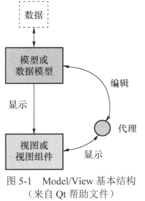
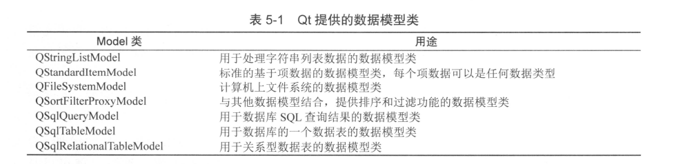
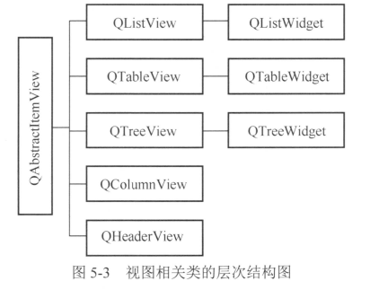

# Mode/View结构

## Model/View基本原理                                                                                                                                                                                                                



Model，模型或数据模型，与实际数据通信，并为视图组件提供数据接口。

Delegate，代理，代理功能可以让用户定制数据的界面显示和编辑方式。

模型、视图、代理之间使用**信号与槽通信**。当源数据发生变化时，数据模型**发射信号**通知视图组件；当用户在界面上操作数据时，视图组件**发射信号**表示这些操作信息；当编辑数据时，代理**发射信号**告知数据模型和视图组件编辑器的状态。

## 数据模型

所有的基于项数据(item data)的数据模型(Model)都是基于QAbstractItemModel类的，这个类定义了视图组件和代理存取数据的接口。

数据无需存储在数据模型里，数据可以是其他类、文件、数据库或任何数据源。



## 视图组件

视图组件（View）就是显示数据模型的数据的界面组件。

- QListView：用于显示单列的列表数据，适用于一维数据的操作。
- QTreeView：用于显示树状结构数据，适用于树状结构数据的操作。
- QTableView：用于显示表格状数据，适用于二维表格型数据的操作。
- QColumnView：用于多个QListView显示树状层次结构，数字结构的一层用一个QListView显示。
- QHeaderView：提供行表头或列表头的视图组件，如QTableView的行表头和列表头。

视图组件在显示数据时，只调用视图类的setModel()函数，为视图组件设置一个数据模型就可以实现视图组件与数据模型之间的关系，在视图组件上的修改将自动保存到关联的数据模型里，一个数据模型可以同时在多个视图组件里显示数据。



(视图类)View->(便利窗口类)Widget

便利类缺乏对大型数据源进行灵活处理的能力。

## 代理

Delegate就是在视图组件上为编辑数据提供编辑器。

代理负责从数据模型获取相应的数据，然后显示在编辑器里，修改数据后，又将其保存到数据模型中。

QAbstractItemDelegate是所有代理类的基类，作为抽象类，它不能直接使用。他的一个子类QStyledItemDelegate，是Qt的视图组件缺省使用的代理类。

对于一些特殊的数据编辑需求，例如只允许输入整型数，使用一个QSpinBox作为代理组件更恰当，从列表中选择数据时使用一个QComboBox作为代理组件更好。这时，就可以从QStyledItemDelegate继承创建自定义代理类。

## Model/View结构的一些概念

### Model/View的基本结构

不管底层的数据结构是如何组织数据的，QAbstractItemModel的子类都以表格的层次结构表示数据。

数据模型中存储数据的基本单元都是项(item)。每个项都有一个行号、列号、父项(parent item)。3个参数完全可以定义一个项的位置，从而存取数据。


### 模型索引 

为了保证数据的表示与数据存取方式隔离，数据模型中引入了模型索引(model index)的概念。数据模型存取的每一个数据都有一个模型索引，视图组件和代理都通过模型索引来获取数据。

QModelIndex表示模型索引的类。模型索引提供数据存取的一个临时指针，用于通过数据模型提取或修改数据。

因为模型内部组织数据的结构随时可能改变，所以模型索引都是临时的。如果需要使用持久性的模型索引，则要使用QPersistentModelIndex类。

获取模型索引的代码如下：

```C++
//行、列、父节点。List和Table的为QModelIndex（），Tree为父节点
QModelIndex indexA = model->index(0,0,QModelIndex());
```

### 项的角色

在为数据模型的一个项设置数据时，可以赋予其不同项的角色(item role)的数据。

数据模型类QStandardItemModel的项数据类是QStandardItem，其设置数据的函数是:

```c++
void QStandardItem::setData(connst QVariant &value,int role = Qt::UserRole + 1);
```

其中value是需要设置的数据，role是设置数据的角色。一个项可以有不同角色的数据，用于不同的场合。

role是Qt::ItemDataRole枚举类型，有多种取值如Qt::DisplayRole角色是在线图组件中显示字符串的，Qt::ToolTipRole是鼠标提示信息，Qt::UserRole可以自定义数据。

# QFileSystemModel

## QFileSystemModel类的基本功能

QFileSystemModel提供了一个可用于访问本机文件系统的数据模型。QFileSystemModel提供的接口函数，可以创建目录、删除目录、重命名目录、可以获得文件名称、目录名称、文件大小等参数，还可以获得文件的详细信息。

要通过QFileSystemModel获得本机的文件系统，需要用setRootPath()函数为QFileSystemModel设置一个根目录例如：

```c++
QFileSystemModel *model = new QFileSystemModel；
model->setRootPath(QDir::currentPath());
```

静态函数QDir::curremtPath()获取应用程序的当前路径。

获取磁盘文件目录的数据模型类还有一个QDirModel，QDirModel的功能与QFileSystemModel类似，也可以获取目录和文件，但是QFileSystemModel采用单独的线程获取目录文件结构，而QDirmodel不使用单独的线程。

# QStringListModel

## QStringListModel功能描述

QStringListModel用于处理字符串列表的数据模型，他可作为QListView的数据模型，在界面上显示和编辑字符串列表。

setStringList()函数可以初始化数据模型的字符串列表的内容，stringList()返回数据模型内的字符串列表，在关联的ListView组件里编辑修改数据后，数据都会及时更新到数据模型内的字符串列表里。

insertRows()、removeRows()、setData()等，这些操作直接影响数据模型内部的字符串列表。

