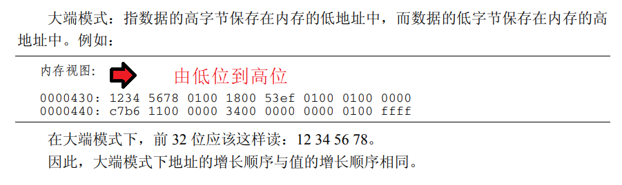
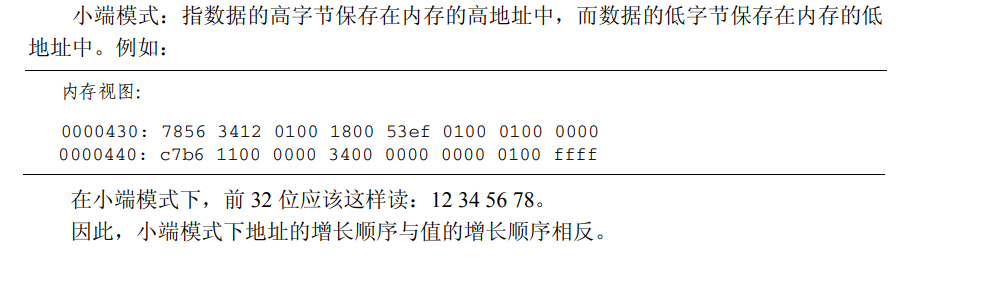

# 处理器体系结构

## 思考题

### 请简述精简指令集 RISC 和复杂指令集 CISC 的区别。 


### 请简述数值 0x12345678 在大小端字节序处理器的存储器中的存储方式。 

大端:高字节在低位 低字节在高位

小端:高字节在高位 低字节在低位

0x1122为例 0x11为高字节 0x22为低字节





```c
//检测大小端方法
//利用联合体Union
int checkCPU(void)
{
	union w
	{
		int a;
		char b;
	}
	c.a=1;
	return (c.b==1);
}
```


### 请简述在你所熟悉的处理器（比如双核 Cortex-A9）中一条存储读写指令的执行全过程。 

经典处理器架构的流水线为五级流水线：取指、译码、发射、执行、写回。

顺序提交、乱序执行、顺序写入


### 请简述内存屏障（memory barrier）产生的原因。 

1、编译时，编译器优化导致内存乱序访问

2、运行时多CPU间交互引起的内存乱序访问

```c
//barrier()函数告诉编译器，不要为了性能优化而将这些代码重排
#define barrier() __asm__ __volatile__ ("" ::: "memory")
```

弱一致性内存模型：

对同步变量的访问顺序一致的；

在所以之前的写操作完成之前，不能访问同步变量；

在所有之前同步变量的访问完成之前，不能访问(读或者写)数据。


### ARM 有几条 memory barrier 的指令？分别有什么区别？

从ARMv7指令集开始，ARM提供3条内存屏蔽指令。

数据存储隔离(DMB)

数据同步隔离(DSB)

指令同步隔离(ISB)

6．请简述 cache 的工作方式。

7．cache 的映射方式有 full-associative（全关联）、direct-mapping（直接映射）和 set-associative（组相联）3 种方式，请简述它们之间的区别。为什么现代的处理器都使用组 相联的 cache 映射方式？ 

8．在一个 32KB 的 4 路组相联的 cache 中，其中 cache line 为 32Byte，请画出这个 cache 的 cache line、way 和 set 的示意图。 

9．ARM9 处理器的 Data Cache 组织方式使用的 VIVT，即虚拟 Index 虚拟 Tag，而在 Cortex-A7 处理器中使用 PIPT，即物理 Index 物理 Tag，请简述 PIPT 比 VIVT 有什么优势？ 

10．请画出在二级页表架构中虚拟地址到物理地址查询页表的过程。 

11．在多核处理器中，cache 的一致性是如何实现的？请简述 MESI 协议的含义。 

12．cache 在 Linux 内核中有哪些应用？ 

13．请简述 ARM big.LITTLE 架构，包括总线连接和 cache 管理等。 

14．cache coherency 和 memory consistency 有什么区别？ 

15．请简述 cache 的 write back 有哪些策略。 

16．请简述 cache line 的替换策略。 

17．多进程间频繁切换对 TLB 有什么影响？现代的处理器是如何面对这个问题的？ 

18．请简述 NUMA 架构的特点。 

19．ARM 从 Cortex 系列开始性能有了质的飞越，比如 Cortex-A8/A15/A53/A72，请说说 Cortex 系列在芯片设计方面做了哪些重大改进？