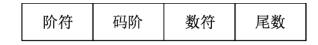
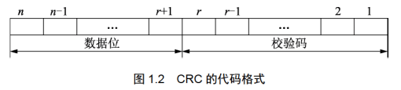
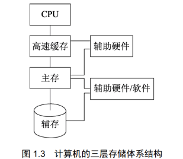
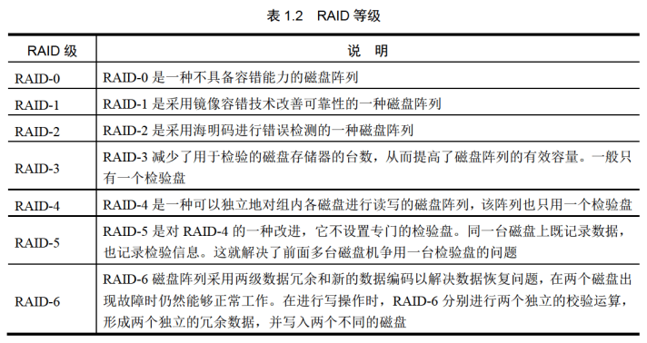
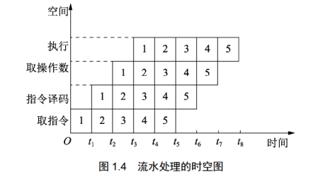

[TOC]

# 计算机系统知识

## 数据表示

​	数据在计算机中表示的形式称为**机器码**，其特点是数的符号用0和1表示。

​	机器码对应的实际数值称为该数的**真值**。机器码分为**无符号数**和**带符号数**两种。

​	无符号数表示正数，在机器码中没有符号位。带符号数中最高位表示正负符号位，其余二进制位表示数值

### 原码、反码、补码、移码

#### 原码

最高位为**符号位**，剩下为数的**绝对值**，0有两个原码

优点：数的真值和它原码表示之间的对应关系简单，相互转化容易，用原码实现**乘除运算的规则简单**

缺点：用原码实现加减运算很不方便

#### 反码

最高位为**符号位**，当符号位为0时，剩下几位为该数的二进制，当符号位为1时，剩下几位**取反**才是它的二进制。0有两个反码

#### 补码

最高位为**符号位**，当符号位为0时，剩下几位为该数的二进制，当符号位为1时，剩下几位取反且最低为加1才是他的二进制值。0只有**一个**补码。

补码表示的两个在进行加法运算时，只要结果不超出机器所能表示的数值范围，可以把符号位与数值位同等处理，运算的结果按2取模后得到的新结果就算本次加法运算的结果。

#### 移码

移码表示法是在数X上增加一个偏移量来定义的，常用于表示浮点数中的阶码。如果机器码字长为n，规定偏移量为 2n-1，则移码定义为：若X是纯整数，则[X]移=2n-1+X(-2n-1≤X<2n-1);若X是存小数，则[X]移=2n-1+X(-1≤X<1)。

### 定点数和浮点数

#### 定点数

所谓定点数，就算小数点的位置固定不变的数。小数点位置通常有两种约定方式：定点整数（纯整数，小数点在最低有效数值位之后）和定点小数（纯小数，小数点在最高有效数值位之前）。

#### 浮点数

浮点数是小数点位置不固定的数，它能表示更大范围的数。浮点数的表示格式如图所示，在浮点表示法中，阶码通常未带符号的纯整数，尾数为带符号的纯小数。

浮点数通常表示为 N=M*RE。

式中，M称之为**尾数**；R称之为**基数**；E称之为**阶码**。

若表示一个浮点数，要给出**尾数M**,它决定了浮点数的表示**精度**；同时要给出**阶码E**，它指出了小数点在数据中的位置，决定了浮点数的表示范围(若表示范围超出了计算机的表达范围，就称之为**溢出**)。

#### 工业标准IEEE 754

IEEE 754是由IEEE指定的有关浮点数的工业标准。该标准的表示形式为

(-1)^s2^E(b~0~b~1~b~2~b~3~...b~p-1~)

式中，(-1)^S^为浮点数的数符，当S为0时表示负数；E为指数(阶码)，用移码表示；(b~0~b~1~b~2~b~3~...b~p-1~)为尾数，其长度为P，用原码表示。

## 校验码

确保数据在传输工程中正确无误两个方法：一、提高硬件电路的可靠性；二、提高代码的校验能力。包括查错和纠错。

检验码：检测传输的数据是否出错

码距：一个编码系统中任意两个编码之间至少有多少个二进制位不同

### 奇偶校验

奇偶校验是一种简单有效的校验方法。其基本思想是在编码中增加一位校验位，来时编码中1的个数为奇数(奇校验)或者为偶数(偶校验)，从而使码距变为2。

对于奇校验，它可以检测代码中奇数位出错的编码，但不能发现偶数位出错的情况，即当合法编码中奇数位发生了错误，也就是编码中的1变成了0或者0变成了1，则该编码中1的个数的奇偶性发生了变化，从而可以发现错误。

常用的奇偶检验码有3种：水平奇偶检验码、垂直奇偶检验码、水平奇偶检验码。

### 海明码

海明码的构成方法是：在数据位之间插入k给检验码，通过扩大码距来实现检错和纠错。设数据为是n位，检验位是k位，则n和k必须满足2^k^-1≥n+k的关系。

### 循环冗余校验码

循环冗余校验码(CRC)广泛应用于数据通信领域和磁介质存储系统中。它利用生成多项式为k个数据位产生r个校验位来进行编码，其编码长度为k+r。CRC的代码格式

​	由此可知，循环冗余校验码是由两部分组成的，左边位信息码(数据)，右边位校验码。若信息码占k位，则校验码就占n-k位。其中，n为CRC码的字长，所以CRC码又称为(n,k)码。校验码是由信息码产生的，校验码越长，则该代码的校验能力越强，在求CRC编码时，采用的是模2运算。模2运算加减运算的规则是**按位运算**，**不会发生错位和进位**。

## 计算机系统硬件组成

计算机系统的基本硬件由**运算器、控制器、存储器、输入设备、输出设备**组成

**运算器、控制器**等部件集成在一起统称为中央处理单元（CPU）。CPU是硬件系统的核心，用于数据的加工处理，能完成各种算术、逻辑运算、控制功能；

**存储器**是计算机系统中的记忆设备，分为内部存储器和外部存储器。前者速度高、容量小，一般用于临时存放程序、数据以及中间结果；或者容量大、速度慢，可以长期保存程序和数据。

**输入设备和输出设备**合称为外部设备，输入设备用于输入原始数据及各种命令，输出设备则用于输出计算机运行的结果。

### 中央处理单元

#### CPU的组成

CPU主要由**运算器、控制器、寄存器组、内部总线**等部件组成，主要功能有**指令控制、操作控制、时间控制、数据加工**。

##### 运算器

运算器由**算术逻辑单元、累加寄存器、数据缓冲寄存器、状态条件寄存器**组成，它是数据加工处理部件，完成计算机的各种算术和逻辑运算。运算器所进行的全部操作都是由控制器发出的控制信号来指挥的，它是执行部件。运算器主要有两个功能：

1、执行所有的算术运算，如加减乘除等基本运算及附加运算。

2、执行所有的逻辑运算并进行逻辑测试，如与或非、零值测试或两个值的比较等。

下面简要介绍运算器的各组成部件及其功能：

1、算术逻辑单元。ALU是运算器的重要组成部件，负责处理数据。实现对数据的算术运算和逻辑运算。

2、累加寄存器(AC)。AC通常简称为**累加器**，它是一个通用寄存器。其功能是当运算器的算术逻辑单元执行算术或逻辑运算时位ALU提供一个工作区。

3、数据缓冲寄存器(DR)。在对内存储器进行读写操作时，用DF暂时存放由内存储器读写的一条指令或数据字，并将不同时间段内读写的数据隔离开。

4、状态条件寄存器(PSW)。PSW保存由算术指令和逻辑指令运行或测试的结果建立的各种条件码和内容，主要分为状态标志和控制标志，如运算结果进位标志(C)、运算结果溢出标志(V)、运算结果为0标志(Z)、运算结果为负标志(N)、中断标志(I)、方向标志(D)和单步标志等。这些标志通常分别由一位寄存器保存，反映了当前指令执行完成之后的状态。通常，一个算术操作产生一个运算结果，而一个逻辑操作则产生一个判决。

##### 控制器

运算器只能完成运算，而控制器用于控制整个CPU的工作，他决定了计算机运行过程的自动化。它不仅要保证程序的正确执行，而且要能够处理异常事件。控制器一般包括**指令控制逻辑、时序控制逻辑、总线控制逻辑和中断控制逻辑**等几个部分。

指令寄存器(IR)。当CPU执行一条指令时，先把它从内存储器读取到缓冲寄存器中，在送入IR暂存，指令译码器根据IR的内容产生各种微操作指令，控制其他的组成部件工作，从而完成所需的功能。

程序计数器(PC)。PC具有寄存信息和计数两种功能，又称为指令计数器。程序的执行分两种情况，一种是顺序执行，另一种是转移执行。在程序开始执行前，将程序的起始地址送入PC，该地址在程序加载到内存时确定，因此PC的内容即是程序第一条指令的地址。执行指令时，CPU将自动修改PC的内容，以便使其保存的总是将要执行的下一条指令的地址。由于大多数指令都是按顺序来执行的，所以修改的过程通常只是简单地对PC加1。
当遇到转移指令时，后续指令的地址根据当前指令的地址加上一个向前或向后转移的位移量得到，或者根据转移指令给出的直接转移地址得到。

地址寄存器(AR)。AR保存当前CPU所访问的内存单元的地址。由于内存和CPU存在操作速度上的差异，所以需要使用AR保存地址信息，直到内存的读/写操作完成为止。

指令译码器(ID)。指令分为操作码和地址码两部分，为了能执行所有给定的指令，必须对操作码进行分析，以便识别所完成的操作，向操作控制器发出具体的控制信号，控制各部件工作，从而完成所需的功能。

##### 寄存器组

寄存器组可分为专用寄存器和通用寄存器。运算器和控制器中的寄存器是专用寄存器，其作用是固定的。通用寄存器的用途广泛并可由程序员规定其用途，其数目因处理器的不同而有所差异。

##### 多核CPU

核心(Die)又称之为内核，是CPU最重要的组成部分，多核即在一个单芯片上集成两个甚至更多个处理器内核，其中每个内核都有自己的**逻辑单元、控制单元、中断处理器、运算单元、一级Cache、二级Cache共享或独有**，其部件的完成性和单核处理器内核相比**完全一致**。

### 存储系统

计算机的三层存储体系结构如下：

三层存储结构是**高速存储（Cache）、主存储器（MM）和辅助存储器（外存储器）**。若将CPU内部寄存器也看作是存储器的一个层次，那么存储器的层次分为四层。若有些计算机没有高速缓存，那么存储器的层次分为两层，即只有主存和辅存。

#### 存储器的分类

##### 按位置分类

存储器按位置分类可分为**内存**和**外存**。

内存（主存）：用来存储当前运行所需要的程序和数据，速度快，容量小。

外存（辅存）：用来存储当前不参与运行的数据，容量大但速度慢。硬盘是外存。

##### 按材料分类

存储器按材料分类可分为**磁存储器、半导体存储器、光存储器**。

磁存储器：用磁性介质做成，如磁芯、磁泡、磁盘、磁带等。

半导体存储器：根据所用元件可分为双极性和MOS型两类；
						   根据是否需要刷新又可分为静态和动态两类。

光存储器：由光学、电学、机械部件等组成，如光盘存储器。

##### 按工作方式分类

存储器按工作方式分类，可分为**读写存储器和只读存储器**。

读写存储器：既能读取数据也能存入数据的存储器。

只读存储器：根据数据写入方式，又可细分为固定只读存储器、可编程只读存储器、可擦除可编程只读存储器、电擦除可编程只读存储器和闪存存储器。

##### 按访问方式分类

存储器按访问方式分类，可分为**按地址访问的存储器和按内容访问的存储器**。

##### 按寻址方式分类

存储器按寻址方式分类，可分为**随机存储器、顺序存储器和直接存储器**

随机存储器（RAM）：这种存储器可对任何存储单元存入或读取数据，访问任何一个存储单元所需时间都是相同的。

顺序存储器（SAM）：访问数据所需时间与数据的存储位置有关，磁带是典型的顺序存储器。

直接存储器（DAM）：介于随机存取和顺序存取之间的一种寻址方式。磁盘是一种直接存储器，它对磁道的寻址是随机的，而在一个磁道内，则是顺序给寻址。

#### 相联存储器

相联存储器是一种按内容访问的存储器。其工作原理是把数据或数据的一部分作为关键字，将该关键字与存储器中的每一个单元进行比较，找出存储器中所有与关键字相同的数据。
相联存储器可用在高速缓冲存储器中，在虚拟存储器中用作段表、页块或块表存储器，还可用在数据库、知识库中。

#### 高速缓存（Cache）

Cache是位于CPU和主存之间的**高速存储子系统**。采用高速缓存的主要目的提高存储器的平均访问速度，使存储器的速度与CPU速度相匹配、Cache对程**序员是透明的**。其地址变换和数据块的替换算法均由**硬件实现**。
通常Cache被集成到CPU内，以提高访问速度，其主要特点是**容量小、速度快、成本高**。

##### Cache的组成

Cache由两部分组成：**控制部分**和**Cache存储器部分**。

Cache存储器部分用来存放主存的部分复制信息。

控制部分用来判断CPU要访问的信息是否在Cache存储器中，若在即为命中，若不在则没有命中。
命中时直接对Cache存储器寻址；未命中时，要按照替换原则，决定主存的某一块信息放到Cache的哪一块中。

##### Cache中的地址映像方式

因为处理机都是按主存地址访问的，而应从Cache存储器中读写信息，因此就需要地址映像，即把主存中的地址映射成Cache存储器中的地址。地址映像的方式有三种：**直接映像、全相联映像、组相联映像**。

直接映像就是主存的块与Cache中块的对应关系是固定的。主存中的块只能存放在Cache存储器的相同块号中。因此，只要主存地址中的主存区号与Cache中的主存区号相同，则表明访问Cache命中。一旦命中，通过主存地址中的区内块号即可得到要访问的Cache中的块。这种方式的有点是地址变化很简单，缺点是灵活性差。

全相联映像允许主存的任一块可以调入Cache的任一块的空间。在地址变换时，将主存地址高位表示的主存块号与Cache中的主存块号进行比较，若相同则为命中。这种方式的优点是主存的块调入Cache的位置不受限制，十分灵活；其缺点是无法从主存块号中直接获得Cache的块号，变化比较复杂，速度比较慢。

组相联映像是前面两种方法的这种，具体做法是将Cache中的块再分成组。组相联映像就是规定组采用直接映像方法而块采用全相联映像方法。在组相联映像方法中，通过直接映像方法来决定组号，再一组内在用全相联映像方法来决定Cache中的块号。由主存地址高位决定主存区号，与Cache中的区号比较可决定是否命中。主存后面的地址即为组号，但组块号要根据全相联映像方法确定，由记录可以决定组内块号。

##### 替换算法

选择替换算法的目标是使Cache获得最高的命中率。常用的替换算法有以下几种。

随机替换（RAND）算法：用随机数发生器产生一个要替换的块号，将该块替换出去。

先进先出（FIFO）算法：将最先进入的Cache信息块替换出去。

近期最少使用（LRU）算法：将近期最少使用的Cache中的信息块替换出去，这种算法较先进先出算法要好一些，但此法也不能保证过去不常用的将来也不常用。

优化替换（OPT）算法：先执行一次程序，统计Cache的替换情况。有了这样的先验信息，在第二次执行该程序时便可以用最有效的方式来替换，达到最优目的。

若H为Cache的命中率，tc为Cache的存取时间，tm为主存的访问时间，则Cache的等效访问时间ta为
$$
t_a=Ht_c+(1-H)t_m
$$
使用Cache比不使用Cache的CPU访问存储器的速度提升的倍数r可以用下式求得
$$
r=t_m/t_a
$$

#### 虚拟存储器

虚拟存储器是由主存、辅存、存储管理单元及操作系统中的存储管理软件组成的**存储系统**。
程序员使用该存储系统时可以使用的内存空间远大于主存的物理空间，但实际上并不存在那么大的主存，故称其为虚拟存储器。虚拟存储器的大小空间取决于计算机的访存能力而不是实际外存的大小，实际存储空间可以小于虚拟地址空间。从程序员的角度看，**外存被看作逻辑存储空间**，访问的地址是一个逻辑地址（虚地址），虚拟存储器使存储系统既具有相当于**外存的容量又具有接近于主存的访问速度**。

虚拟存储器的访问也涉及**虚地址与实地址的映像、替换算法**等，这与Cache1中的类似。地址映像以块为单位，而在虚拟存储器中，**地址映像以页为单位**。设计虚拟存储器系统需考虑的指标是**主存空间利用率和主存的命中率**。

#### 外存储器

外存储器用来存放暂时不用的程序和数据，并且以文件的形式存储，CPU不能直接访问外存中的程序和数据，将其以文件为单位调入主存后方可访问。外存由磁表面存储器及光盘存储器构成。

##### 磁盘存储器

磁盘容量有两种指标：一种是非格式化容量，它是指一个磁盘所能存储的总位数；另一种是格式化容量，它是值各扇区中数据区容量的总和。计算公式分别如下:

非格式化容量=面数x(磁道数/面)x内圆周长x最大位密度

格式化容量=面数x(磁道数/面)x(扇区数/道)x(字节数/扇区)

##### 光盘存储器

光盘存储器的类型分为只读型光盘、只写一次型光盘和可擦除型光盘。

光盘存储器的特点是记录密度高，容量大，采用非接触式读写信息，信息可保存时间长，多通道记录时数据传速率可超过200MB/s,制造成本低，对机械结构的精度要求不高，存取时间较长。 

#### 磁盘阵列技术

磁盘阵列由多台磁盘存储器组成，是快速、大容量、高可靠的外存系统。现在常见的独立冗余磁盘阵列（RAID）就是一种由多块独立磁盘构成的冗余阵列。虽然RAID包含多块磁盘，但是在操作系统下是作为一个独立的大型存储设备出现的。RAID技术分为一下不同等级，分别提供不同的速度、安全性和性价比。

 

### 输入/输出技术

#### 常见的内存与接口的编址方法

##### 内存与接口地址独立的编址方法

内存地址与接口地址完全独立且相互隔离，在使用中内存用于存放程序和数据，而接口就用于寻址外设。这种编址方法的优点是在编程序和读程序时很容易使用和辨认；缺点是用于接口的指令太少，功能太弱。

##### 内存与接口地址同一编址的方法

内存地址与接口地址统一在一个公共的地址空间，在这些地址地址空间里将一些地址分配给接口使用，而剩下的就可以归内存使用。这种编址方法的优点是原则上用于**内存的指令全部都可以用于接口**。其缺点在于整个地址空间被分成两部分，一部分分配给接口使用，另一部分分配给内存使用，这经常会导致**内存地址不连续**；另外用于内存的指令和用于接口的指令完全一样，在读程序时要根据参数定义仔细加以辨认。

#### CPU与外设之间的数据传输方式

CPU与外设之间的数据传输方式有如下几种：

##### 程序直接控制方式

程序直接控制方式是指在完成数据的输入/输出中，整个输入/输出过程是在CPU执行程序的控制下完成的 。这种方法还可以分为以下两种。

无条件传送方式：无条件地与CPU交换数据。

程序查询方式：先通过CPU查询外设状态，准备好之后再与CPU交换数据。程序查询方式有两大缺点：
1、降低了CPU的效率；
2、对外部的突发事件无法做出实时响应
其优点在于这种思想容易理解，同时实现这种工作方式也很容易。

##### 中断方式

中断方式利用中断机制，使I/O系统在外设交换数据时，CPU无须等待，也不必查询I/O状态，即可抽身出来处理其他任务，因此提高了系统效率。

中断处理方法有**中断信号线法、中断软件查询法、菊花链法、总线仲裁法、中断向量表法**。

中断优先级控制。在进行优先级控制时要解决以下两种情况：
1、当不同优先级的多个中断源同时提出中断请求时，CPU应优先响应优先级最高的中断源。
2、当CPU正在为某一个中断源服务时，若有更高优先级的中断源提出中断请求，CPU应能暂时中断正在执行的中断服务程序而转去执行优先级更高的中断源服务，服务结束后再回到原先被中断的优先级较低的中断服务程序继续执行。

##### 直接存储器存取方式（DMA）

DMA方式是在存储器与I/O设备间直接传送数据，即在内存与I/O设备之间传送一个数据块的过程中，不需要CPU的任何干涉，是一种完全由DMA硬件完成I/O操作的方式。

##### 输入/输出处理机（IOP）

IOP是一个专用处理机，用于完成主机的输入/输出操作。IOP根据主机的I/O命令，完成对外设数据的输入/输出。他的数据传送方式有三种：**字节多路方式、选择传送方式和数组多路方式**。

### 总线结构

#### 总线的定义与分类

任何连接两个以上电子元器件的导线都可以称为总线。总线分为以下三类：

内部总线：用于芯片一级的互连，分为芯片内总线和元件级总线。芯片内总线用于集成电路芯片内部各部分的连接，元件级总线用于以块电路板内各元器件的连接。

系统总线：用于插件板一级的互联，用于构成计算机各组成部分（CPU、内存和接口等）的连接。

外部总线：又称通信总线，用于设备一级的互联，计算机可通过该总线和其他设备进行信息与数据交换。

#### 系统总线

系统总线是微处理器芯片对外引线信号的延伸或映射，是微处理器与外存储器及I/O接口传输信息的通道。系统总线有时也称内总线，目前比较流行的内总线如下：

ISA：工业标准总线，向上兼容更早的PC总线，在PC总线62给插座信号的基础上扩充另外一个具有36个信号的插座构成ISA总线，包括24条地址线、16条数据线。

EISA：在ISA总线的基础上发展起来的32位总线。该总线定义32位地址线、32位数据线，以及其他控制信号线、电源线等共196个连接点。EISA总线的传输速率达33MB/s。该总线利用总线插座与ISA总线相兼容。

PCI：这是当前最流行的总线之一，由Intel公司推出的一种局部总线。它定义了32位数据总线，且可扩展为64位。PCI总线的传输速率至少为133MB/s，64位PCI总线的传输速率为266MB/s。PCI总线的工作与处理器相互独立。PCI总线上的设备是即插即用的。

#### 外部总线

外部总线简称为外总线，常见外总线标准如下：

RS-232-C：一种串行外总线，主要特点是所需传输线比较少，最少只需3条线即可实现全双工通信；传输距离远，用电平传送为15m，用电流环传送为1km；有多种可供选择的传输速率，具有较好的抗干扰性。

SCSI：一种秉性外总线，广泛用于连接硬盘、光盘等。该总线上最多可接63种外设，传输距离可达20m。

USB：USB总线是一种PC串行通信协议。USB由4条信号线组成，可以经过集线器进行树状连接，最多可达5层，该总线上可接127个设备，最大优点是支持即插即用技术且支持热插拔。

IEEE-1394：一种串行外总线，由6条信号线组成，可接63个设备，最大优点是支持即插即用技术且支持热插拔。

### 指令系统

指令系统指的是一个CPU所能够处理的全部指令的集合，是一个CPU的根本属性。一条指令一般包括两个部分：**操作码和地址码**

操作码指明操作的类型；地址码指明操作数及运算结果存放的地址。

#### 寻址方法

寻址指令中操作数有效地址的方式称为寻址方法。常见的寻址方法有以下几种：

立即寻址：操作数作为指令的一部分直接写在指令中，这种操作数称为立即数。

寄存器寻址：指令所要的操作数已存储在某寄存器中，或把目标操作数存入寄存器。

直接寻址：指令所要的操作数存放在内存中，在指令中直接给出该操作数的有效地址。

寄存器间接寻址：操作数在存储器中，操作数的有效地址用SI、DI、BX和BP四个寄存器之一来指定。

寄存器相对寻址：操作数在存储器中，其有效地址是一个基址寄存器（BX、BP）或变址寄存器（SI、DI）的内容和指令中的8位/16位偏移量之和。

基址加变址寻址方式：操作数在存储器中，其有效地址是一个基址寄存器和一个变址寄存器的内容之和。

相对基址加变址寻址：操作数在存储器中，其有效地址是一个基址寄存器的值、一个变址寄存器的值和指令中的8/16位偏移量之和。

#### CISC和RISC

CISC，复杂指令集计算机，基本思想是进一步增强原有指令的功能，用更为复杂的新指令取代原先由软件子程序完成的功能，实现软件功能的硬化，导致机器的指令系统越来越庞大而复杂。

RISC，精简指令集计算机，基本思想是通过减少指令总数和简化指令的功能，降低硬件设计的复杂度，使指令能单周期执行，并通过优化编译，提高指令的执行速度，采用影线控制逻辑，优化编译程序。

RISC的关键技术如下：

- 重叠寄存器窗口技术。在伯克利的RISC项目中，首先采用了重叠寄存器窗口技术。
- 优化编译技术。RISC使用了大量的寄存器，如何合理分配寄存器、提高寄存器的使用效率及减少访问次数等，都应通过编译技术的优化来实现。
- 超流水及超标量技术。这是RISC为了进一步提高流水线速度而采用的技术。
- 硬布线逻辑与微程序在微程序技术中相结合。

#### 指令的流水处理

##### 指令控制方式

指令控制方式有**顺序方式、重叠方式、流水方式**三种。

顺序方式：指各条机器指令之间顺序串行地执行，执行完一条指令后才读取下一条指令，而且每条机器指令内部的各个微操作也是顺序串行地执行。

重叠方式：指在第x条指令的操作完成之前，就可开始解释第x+1条指令。通常采用的是一次重叠，即在任何时候，指令分析部件和指令执行部件都只有相邻两条指令在重叠解释。

流水方式：流水方式是指并行性或并发性嵌入计算机系统里的一种形式，它把重复的顺序处理过程分解为若干子过程，每个子过程能在专用的独立模块上有效地并发工作，时空图如下所示

在概念上，“流水”可以看作是“重叠”的延伸。差别仅在于“一次重叠”只是阿布一条指令解释分解为两个子过程，而“流水”则分解为更多的子过程。

##### 吞吐率和流水建立时间

吞吐率是指单位时间里流水线处理机流出的结果数。对指令而言，就是单位时间里执行的指令数。如果流水线的子过程所用时间不一样，则吞吐率p应为最长子过程的倒数，即
$$
p=1/max\left\{\Delta t_1,\Delta t_2,\Delta t_3,\cdots ,\Delta t_{max} \right\}
$$
流水线开始工作后，须经过一定时间才能达到最大吞吐率，这就是建立时间。若m给子过程所用时间一样，均为 $$\Delta t_0$$,则建立时间$$T_0=m\Delta t_0$$。

### 可靠性与系统性能评测

#### 计算机可靠性

##### 计算机可靠性描述

计算机系统的可靠性是指从它开始运行(t=0)到某个时刻t这段时间内能正常运行的概率，用R(t)表示。

失败率是指单位时间内失效的元件数与元件总数的比例，用$\lambda$表示。当$\lambda$为常数时，可靠性与失败率的关系为$R(t)=e^{-\lambda t}$。

两次故障之间系统能正常工作的时间的平均值称为平均无故障时间（MTBF），即MTBF=1/$\lambda$。

通常用平均修复时间(MTRF)来表示计算机的可维修性，即计算机的维修效率，指从故障发生到机器修复平均所需要的时间。计算机的可用性是指计算机的使用效率，它以系统在执行任务的任意时刻能正常工作的概率A来表示，即
$$
A=\frac{MTBF}{MTBF+MTRF}
$$
计算机的RAS技术是指用可靠性R、可用性A和可维修性S这三个指标衡量一个计算机系统。但在实际应用中，引起计算机故障的原因除了元器件以外，还与组装工艺、逻辑设计等因素有关。

##### 计算机可靠性模型

常见的计算机可靠性数学模型如下。

串联系统。可靠性为$R=R_1R_2...R_N$,失败率为$\lambda=\lambda_1+\lambda_2+\lambda_3....\lambda_N$。

并联系统。可靠性为$R=1-(1-R_1)*(1-R_2)*...*(1-R_N)$，失败率为
$$
\upsilon=\frac{1}{\frac{1}{\lambda}\sum_{j=1}^{N}{\frac{1}{j}}}
$$
N模冗余系统。可靠性为
$$
R=\sum_{j=n+1}^{N}{
\left(
\begin{array}{c}
i \\ N
\end{array}
\right)
*R^i_0(1-R_0)^{N-i}}
$$
提高计算机的可靠性一般采用两项措施：一是提高元器件的质量，改进加工工艺与工艺结构，完善电路设计；二是发展容错技术。

#### 计算机系统的性能评价

##### 性能评测常用方法

时钟频率：计算机的时钟频率在一定程度上反映了机器速度，主频越高速度越快

指令执行速度：速度是计算机的主要性能标准之一。

等效指令速度法：统计各类指令在程序中所占的比例，并进行折算

数据处理法（PDR）法：采用计算PDR值的方法来衡量机器性能，PDR值越大，机器性能越好，PDR与每条指令和每个操作数的平均位数以及每条指令的平均速度有关。
核心程序法：把应用程序中使用最频繁的那部分核心程序作为评价计算机性能的标准程序，在不同的机器上运行，测得其执行时间，作为各类机器性能评价的依据。

##### 基准测试程序

基准测试程序法是目前一致承认的测试性能的较好方法。

整数测试程序

浮点测试程序

SPEC基准测试程序

TPC基准测试程序

## 考点

1. Cache与主存的地址映射由**硬件自动**完成

2. 流水线的**周期**是指令中用时**最长的指令执行时间**

3. 计算所需存储芯片个数，$所需芯片个数=abs(地址差)*8/一片的容量$，单位均为bit

4. 计算机主存主要是由内存(DRAM)构成的,SRAM是高速缓存（Cache），EEPROM是辅存

5. 海明码是奇偶校验的补充，海明码可以发现错误、纠正错误

6. 程序查询方式是按顺序执行的方式，由CPU全程控制，无法实现外设与CPU的并行工作。在外设做好数据传输前，CPU可做自己的事。发出中断请求后CPU才去响应控制其数据传输过程，一定程度上实现CPU与外设并行。DMA方式由DMA控制器向CPU申请总线的控制权，获取CPU的总线控制权后由DMA代替CPU控制数据传输过程。

7. 累加器（AC），全称累加寄存器！可存放算术运算或逻辑运算时，源操作数和结果。
   程序计数器（PC），存放执行指令的地方，计算之前就要用到。
   指令寄存器（IR），保存当前正在执行的一条指令。
   地址寄存器（AR），用来保存当前CPU索要访问的内存单元的地址

8. 中断、程序查询、无条件传送都需要CPU参与。

9. 计算海明码信息位，N为添加海明码后二进制位数，K为有效信息数，r为校验码位,需满足**$2^r>=K+r+1=N$**

10. 指令和数据都存储在内存中，取值周期取出的是指令，执行周期取出的是数据。

11. PC（程序计数器）用来存放下一条指令所在单元的地址。当执行一条指令时，处理器首先需要从PC中取出指令所在内存中的地址，通过地址总线寻址获取。

12. 如果浮点数的阶码用R位的移码表示，尾数用M位的补码表示，则浮点数表示的数值范围如下
    $$
    [-1*2^{(2^{R-1}-1)},+(1-2^{-M+1}*2^{(2^{R-1}-1)}]
    $$

13. VLIW，超长指令字，增加运算的速度。

14. 补码->反码->反码加一得到原码

15. 单总线结构所有设备均挂在单一总线上。有点控制简单，扩充方便，缺点只能分时工作。

16. CPU在一个总线周期结束后响应DMA请求

17. $N=2^E*F$,E为阶码决定浮点数的范围，F尾数决定浮点数所表示的精度

18. Cache地址映像中，发生块冲突次数最小的是**全相联映像**

19. CPU的中断响应时间，是从发出**中断请求到进入中断处理程序的时间**

20. 三总线结构的计算机总线系统由**数据总线、地址总线、控制总线**组成

BDDAD DCDBA

BDDAD BCDBA

# 程序语言基础知识

## 程序语言概述

### 低级语言和高级语言

低级语言：机器语言和汇编语言。机器语言用0、1字符串组成的机器指令序列，是最基本的计算机语言；汇编语言是指用符号表示指令的语言。

高级语言：需要编译成特定机器上的目标代码才能执行。